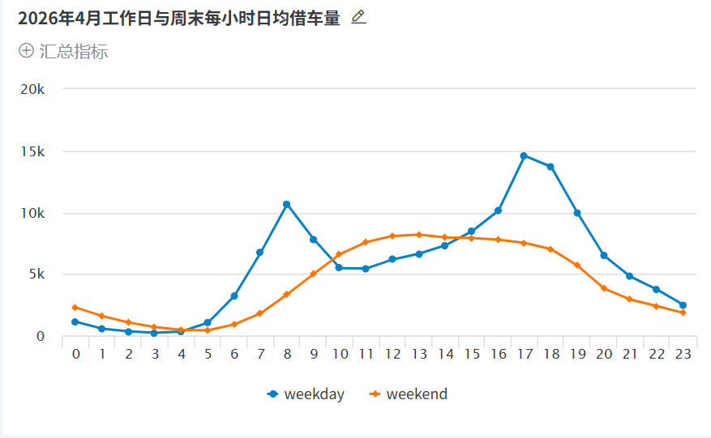
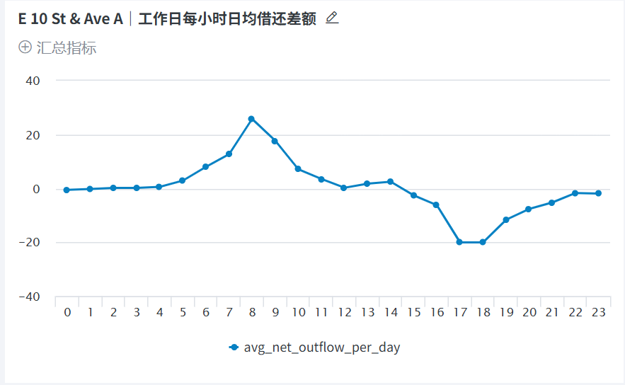
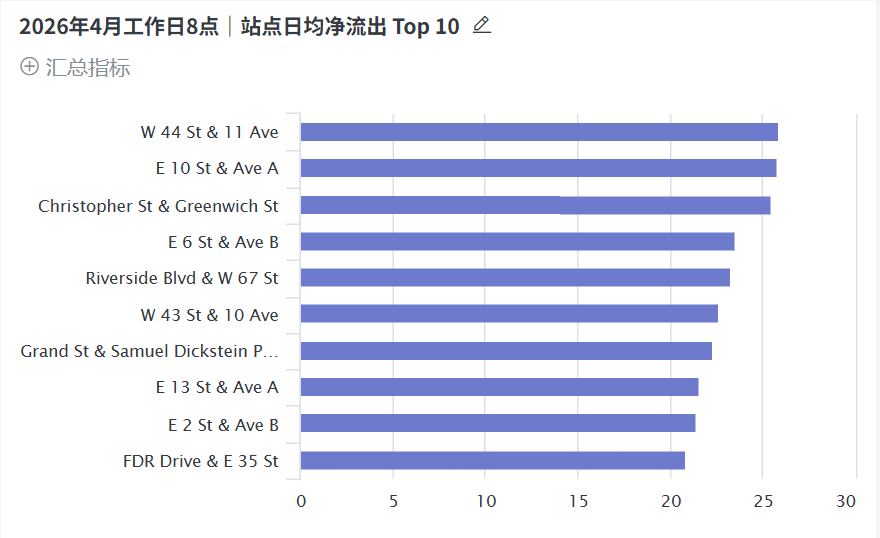

# Citi Bike 站点时段性借还流向分析（2026 年 4 月）

使用 Python、DuckDB SQL 和观远 BI 分析纽约共享单车的借还时段与站点流向，提出可进一步核查的运营站点名单。

## 业务问题

1. 工作日与周末的借车高峰是否不同？
2. 哪些站点在工作日早高峰呈现较大的借出与归还差额？
3. 早晚方向是否反转，且这一模式是否在多个工作日重复出现？

本项目将“净流出”定义为同一站点、同一时段的**借出次数减归还次数**。它描述已完成骑行的方向，不代表站点实际库存、缺车时长或流失订单。

## 数据来源与工具

- 数据：[Citi Bike System Data](https://citibikenyc.com/system-data) 中的 `202604-citibike-tripdata.zip`，含四个 CSV 分片。研究范围为 2026 年 4 月；获取日期：2026-09-27。
- 开发：Python 3.11.4、DuckDB 1.5.5；数据库文件为 `citibike.duckdb`。
- 可视化：观远 BI 网页版。
- 数据使用遵循 [Citi Bike Data Sharing Policy](https://citibikenyc.com/data-sharing-policy)。作品集提供来源链接、代码与汇总结果，不作为独立数据集重新发布原始交易文件。

## 数据处理与口径

| 检查项 | 结果 |
| --- | ---: |
| 原始骑行记录 | 3,860,371 |
| 不同 `ride_id` | 3,860,371 |
| 缺失起点站 ID | 1,939 |
| 缺失终点站 ID | 10,498 |
| 无法解析的起终点时间 | 0 |
| 结束时间不晚于开始时间 | 0 |
| 骑行时长超过 24 小时 | 766 |
| 清洗后保留 | 3,848,139 |
| 清洗排除 | 12,232（约 0.32%） |

保留规则：`ride_id`、起终点站 ID 和时间有效，结束时间晚于开始时间，且时长不超过 24 小时。24 小时是本项目用于站点时段分析的筛选阈值，超长骑行并不必然是错误。各异常类别可能重叠，所以不能将表中的缺失和超长数量相加来计算排除总数。

按骑行开始时间划分工作日与周末：2026 年 4 月有 22 个工作日、8 个周末日。日均借车量为该类日期在对应小时的借车总量除以该类日期的天数。站点小时净流出同理，以对应的 22 或 8 天为分母。站点分析中仅保留发生在 4 月内的起点或终点事件，因此跨到 5 月的还车不计入 4 月站点小时归还量。

## 主要发现

1. **时段结构不同。** 工作日借车量最高的是 17 点，日均约 14,591.9 次；8 点也有明显高峰，日均约 10,651.3 次。周末高峰在 12—14 点，其中 13 点日均约 8,189.6 次。比较工作日和周末时使用日均值，避免两类日期天数不同造成误导。
2. **早高峰流向集中。** 在工作日 8 点月度借还合计至少 100 次的站点中，日均净流出最高的前两站是 W 44 St & 11 Ave（25.9）和 E 10 St & Ave A（25.8）。前 10 站的日均净流出介于 20.8 与 25.9 次之间。该榜单是需进一步核查的候选名单，不是实际缺车站点榜单。
3. **个案模式稳定。** E 10 St & Ave A 在 4 月全部 22 个工作日的 8 点均为净流出，17 点及 18 点均为净流入。8 点日均净流出 25.8 次、中位数 27；17 点日均净流入 20.0 次、中位数 18；18 点日均净流入 20.0 次、中位数 18.5。其余前十站尚未逐站完成这种每日稳定性核查。

## 运营建议与验证方式

先以 E 10 St & Ave A 为候选观察站，并对榜单上的其他站做逐日复核。运营团队可在早高峰前记录可用车辆，在晚高峰前记录可用空桩，同时记录站点是否开放、天气和异常运营情况。若观察到持续的无车或满桩，再设计调度试点；试点前后比较无车/满桩的实际发生频率，并选择需求相近的站点作对照。

现有公开骑行记录不包含历史站点库存、未完成的借车请求、人工调度及成本。它不能用来估算流失订单、确定具体补车数量、证明调度会提升收入，或把 2026 年 4 月的模式直接当作当前运营状态。

## 项目文件与复现

```text
项目根目录/
├── 202604-citibike-tripdata.zip       # 从官方页面下载；不上传至作品集
├── import_data.py                     # 解压并导入 rides_raw
├── quality_check.py                   # 质量检查
├── run_station_flow.py                # 生成 station_hour_flow
├── check_daily.py                     # E 10 St & Ave A 逐日核查
├── export_powerbi.py                  # 历史文件名；导出供观远 BI 使用的 CSV
├── export_top10.py                    # 早高峰前十名 CSV
├── sql/
│   ├── 02_clean.sql                   # 生成 rides_clean
│   ├── 03_hourly.sql                  # 全市小时指标
│   ├── 04_day_type.sql                # 工作日/周末小时指标
│   └── 05_station_flow.sql            # 站点小时借还流向
├── data/csv/                           # 解压后的分片（不上传至作品集）
├── outputs/                            # 汇总 CSV
└── citibike.duckdb                    # 本地数据库（不上传至作品集）
```

在 Windows PowerShell 中进入项目目录并安装依赖：

```powershell
py -3 -m venv .venv
.\.venv\Scripts\python.exe -m pip install duckdb==1.5.5
```

按以下顺序运行已有文件（在项目根目录执行）：

```powershell
.\.venv\Scripts\python.exe import_data.py
.\.venv\Scripts\python.exe quality_check.py
.\.venv\Scripts\python.exe -c "import duckdb,pathlib; c=duckdb.connect('citibike.duckdb'); c.execute(pathlib.Path('sql/02_clean.sql').read_text(encoding='utf-8')); c.close()"
.\.venv\Scripts\python.exe -c "import duckdb,pathlib; c=duckdb.connect('citibike.duckdb'); c.execute(pathlib.Path('sql/03_hourly.sql').read_text(encoding='utf-8')); c.close()"
.\.venv\Scripts\python.exe -c "import duckdb,pathlib; c=duckdb.connect('citibike.duckdb'); c.execute(pathlib.Path('sql/04_day_type.sql').read_text(encoding='utf-8')); c.close()"
.\.venv\Scripts\python.exe run_station_flow.py
.\.venv\Scripts\python.exe check_daily.py
.\.venv\Scripts\python.exe export_powerbi.py
.\.venv\Scripts\python.exe export_top10.py
```

`02_clean.sql` 使用 `CREATE OR REPLACE`，重复运行会重建清洗表。若把分析月份换成其他月份，需相应修改 `05_station_flow.sql` 中的日期范围及工作日/周末天数，并重新检查站点 ID 与名称。

## 可视化作品

观远 BI 中使用本地导出的汇总 CSV 制作了三张卡片：

| 卡片 | 数据文件 | 主要字段 |
| --- | --- | --- |
| 工作日与周末每小时日均借车量 | `outputs/demand_day_type.csv` | `hour_of_day`、`day_type`、`avg_departures_per_day` |
| E 10 St & Ave A 工作日每小时日均借还差额 | `outputs/station_hour_flow.csv` | 筛选站点和 `weekday`，使用 `hour_of_day`、`avg_net_outflow_per_day` |
| 工作日 8 点净流出 Top 10 | `outputs/weekday_8am_top10.csv` | `station_name`、`avg_net_outflow_per_day` |

### 工作日与周末分时需求



### 重点站点分时借还流向



### 工作日早高峰候选站点




